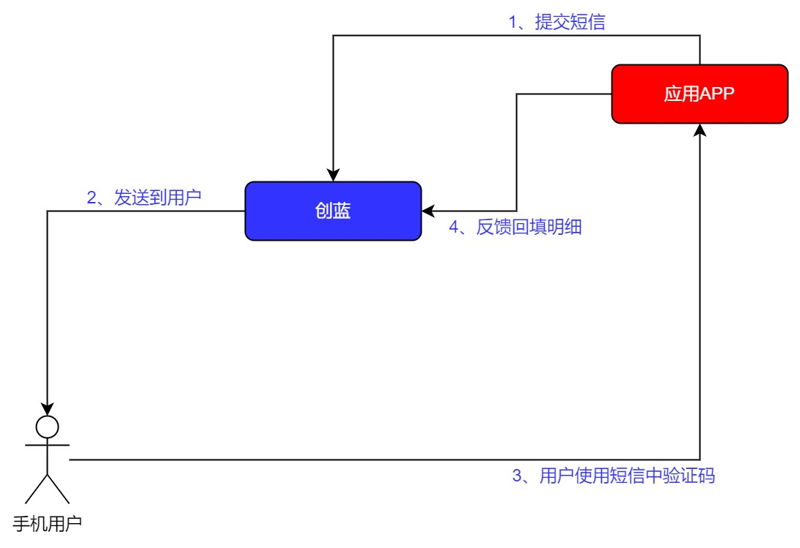

# chuanglan international

253 international SMS API for cloud communication

## Interface specification

Notes on SMS access：
1. API account and password parameters shall be provided by us
2. If you need to push the status report, please provide the callback address to bind our operation personnel (the mass delivery interface does not support status push at present).
3. Only HTTP POST request mode is supported
4. The encoding is unified using utf-8
5. The request header content-type must be set correctly according to the interface requirements, otherwise it may cause parameter passing errors
6. SMS content signature is not mandatory, some countries can be empty, please consult the operation personnel
7. The mobile phone number format is area code + real mobile phone number, for example, China area code is 86, example: 861888888888888

## 目录

 1. [Message issued](#a-messageissued)
 2. [Query balance](#a-querybalance)
 3. [State of the callback](#a-stateofthecallback)
 4. [The upward push](#a-theupwardpush)
 5. [Group messaging（json)](#a-groupmessaging)
 6. [Voice verification code](#a-voicecode)
 7. [Pull up the uplink message details](#a-pulldetails)
 8. [Pull the status report](#a-statusreport)
 9. [Status code](#a-statuscode)
 10. [Conversion Rate](#a-ConversionRate)


<a id="a-messageissued"></a>
## 1 Message issued

### 1.1 Agreement that
name|instructions
:---|:---
agreement|HTTP POST
Coding format|UTF8
Content-Type|application/json
URL(Shanghai)|https://intapi.253.com/send/sms
URL(Sigapore)|http://intapi.sgap.253.com/send/sms

### 1.2 Request Header
name|data type|required|example|instructions
:---|:---|:---|:---|:---
sign|string|Y|1234abcd7890qwer|signature
nonce|string|Y|1653043349000|timestamp

### 1.3 Request Body
name|data type|required|example|instructions
:---|:---|:---|:---|:---
account|string|Y|I6000000|API account, no more than 50 digits
mobile|string|Y|8615800000000|Mobile phone number, format (area code + mobile phone number), for example: 8615800000000, where 86 is China's area code，The area code does not start with 00, and 15800000000 is the real phone number to receive the SMS. 5-20.
msg|string|Y|this is your message|ext message content. Length must not exceed 536 characters
senderId|string|N|SENDER|The sender displayed after the user receives the message is not supported in China or abroad, but needs to communicate with the operator in advance for registration. Please confirm with TIG docking personnel for details.

> Sign generate Method
1. assign current timestamp to header param `nonce`;
2. sort `nonce` and parameter names in request body by ascii, then join them like: k1v1k2v2k3v3
3. append password to the joined string
4. encrypt the string with md5,  `sign` is the lowercase of the ciphertext. 

 ### 1.4 Response
 
 name|data type|example|instructions
:---|:---|:---|:---
code|string|0|status code: 0-success, none-zero means failure
error|string|insufficient balance|Status code description (empty string returned on success, return on failure, e.g., insufficient balance)
msgid|string|17041010383624511|message id

 Note: code is the response status code, which can be compared with the submitted response status code
<br/>
<br/>
<br/>
<a id="a-querybalance"></a>
## 2 Query balance


### 2.1 Agreement that

|name|instructions|
|:---|:---|
|agreement|HTTP POST|
|Coding format|UTF8|
|Content-Type|application/json|
|URL|`http://intapi.253.com/balance/json`|

### 2.2 Request

& The request is a json string with the following parameters：
```json
 {
     "account"` : "I6000000", //API account, no more than 50 digits. mandatory
     "password"` : "12345678" //API account corresponding to the key, contact customer service to obtain. mandatory
 }
```
### 2.3 Response

& This response is the submission response, please get the status report to confirm whether it was successfully sent to the phone
```json
 {
     "code": "0", //Status code<br/> 
     "error": "", //Status code description (empty string returned successfully)<br/> 
     "balance": "7.298" //The remaining available balance, three decimal points<br/> 
 }
```
 Note: code is the response status code, which can be compared with the submitted response status code
<br/>
<br/>
<br/>

<a id="a-stateofthecallback"></a>
## 3 State of the callback

### 3.1 Agreement that

|name|instructions|
|:---|:---|
|agreement|HTTP GET|
|Coding format|UTF8|
|Content-Type|application/x-www-form-urlencoded|
|pushUrl|This address is provided by the customer, which is provided to the operation binding, one account and one address|

### 3.2 The callback example


`http://pushUrl?receiver=admin&pswd=12345&msgid=12345&reportTime=1012241002&mobile=13900210021&status=DELIVRD¬ifyTime=180828114243&batchSeq=I0123456_1808281142_2188000`


Parameter description is as follows：
```
receiver：The user name (not the account name) verified by the receiving status report is the name configured as required by the user and is empty by default
pswd：Receive the password verified by the status report, which defaults to null
msgid：Msgid returned by platform when SMS is submitted
reportTime：The gateway platform returns the time, the gateway is different, the format has the deviation, the specific return format shall prevail.
notifyTime：Interface server returns time in format YYMMDDhhmmss, where YY= last two digits of year (00-99), MM= month (01-12), DD= day (01-31), hh= hours (00-23) 
, MM= minutes (00-59),ss= seconds (00-59).
mobile：The mobile phone number at the time of submitting the message
status：Status report status code
batchSeq：SMS batch number。
```


```
Note:
1. Response string :OK if received successfully
2. Status is the status code of status report, which can be compared with the status code of status report
```
<br/>
<br/>
<br/>
<a id="a-theupwardpush"></a>

## 4 The upward push

### 4.1 Agreement that

|name|instructions|
|:---|:---|
|agreement|HTTP GET|
|Coding format|UTF8|
|Content-Type|application/x-www-form-urlencoded|
|pushUrl|This address is provided by the customer, which is provided to the operation binding, one account and one address|

### 4.2 The callback example

 `http://pushMoUrl?receiver=admin&pswd=12345&moTime=1208212205&mobile=13800210021&msg=hello&destcode=CHUANGLAN`

 Parameter description is as follows：
``` 
receiver：The user name that receives uplink validation (not the account name) is the name configured according to the user's request and is empty by default
pswd：Receive the uplink authenticated password, which defaults to null
moTime：The upside of time
mobile：Uplink phone number
msg：Uplink message content
destcode：User uplink destination number
```


Note:
1. Response string :OK if received successfully
<br/>
<br/>
<br/>

<a id="a-groupmessaging"></a>
## 5 Group messaging（json）

**brief description:**
* SMS group interface（json）

**request URL:**
* `http://intapi.253.com/send`

**request method:**
* POST<br/>
content-type：application/json

**parameter：**

|Parameter name|mandatory|type|instructions|
|:---|:---|:---|:---|
|account|yes|string|account|
|password|yes|string|password|
|msg|yes|string|Message content|
|mobile|yes|string|phone number|
|senderId|no|string|sender|
<br/>

**Sample request**

```JSON
{
    "account":"I6428061", //API account, no more than 50 digits. mandatory<br/> 
    "password":"123456", //API account corresponding to the key, contact customer service to obtain. mandatory<br/> 
    "msg":"【253】你好，您的验证码是：123456", //Text message content. Length must not exceed 536 characters<br/> 
    "mobile":"8613011111111,8613022222222,8613033333333", //Mobile phone number, format (area code + mobile phone number), for example: 8615800000000, where 86 is China's area code，The area code does not start with 00, and 15800000000 is the real phone number to receive the SMS. 5-20. mandatory<br/> 
    "senderId":"" //The sender displayed after the user receives the message is not supported in China or abroad, but needs to communicate with the operator in advance for registration. Please confirm with TIG docking personnel for details. optional<br/> 
}
```
        
<br/>

**Return parameter specification**

|Parameter name|type|instructions|
|:---|:---|:---|
|code|string|Return code|
|message|string|The message|
|data|object|The packet|
|messageId|string|Message id|
|errorPhone|array|Wrong phone number|
<br/>

**Return sample (single)**<br/>

```JSON
 {
    "code": "0",
    "message": "成功",
    "data": {
        "messageId": "17122614541000000355"
    }
}
```
        
Single issue returns a single message id
<br/>
<br/>

**Return sample (group)**<br/>

```JSON
{
    "code": "0",
    "message": "成功",
    "data": {
        "messageId": "I6428061_1712261459_40",
         "errorPhone": []
    }
}
```

A batch message id is returned
<br/>
<br/>

**Return sample (send error)**

```JSON
{
    "code": "123",
    "message": "Text messages cannot be empty",
    "data": null
}
```
        
**Return code**

|code|instructions|
|:---|:---|
|0|success|
|101|Account does not exist|
|102|Password mistake|
|106|The text message length exceeds the 536 character limit|
|108|Wrong format of mobile phone number|
|109|Wrong number of mobile phone|
|110|Lack of balance|
|112|Product is wrong|
|114|Client IP error|
|115|Send permission error|
|123|The text message is empty|
|125|A certain customer's phone number must not exceed 10 times on the same day|
|128|Account length is over 50 digits|
|129|Product price configuration error|
<br/>
<br/>
<br/>


<a id="a-voicecode"></a>
## 6 Voice verification code

### 1.1 Agreement that

|name|instructions|
|:---|:---|
|agreement|HTTP POST|
|Coding format|UTF8|
|Content-Type|application/json|
|URL|`http://intapi.253.com/sendVoice/OTP`|

### 1.2 Request

& The request is a json string with the following parameters：

```JSON
{<br/> 
     "account" : "I6000001", //API account, no more than 50 digits. mandatory<br/> 
     "password" : "12345678", //API account corresponding to the key, contact customer service to obtain. mandatory<br/> 
     "intro" : "Your verification code is", //Introduction to captcha (read before captcha)<br/> 
     "code" : "869452", //Verification code<br/> 
     "outro" : "don't tell others.", //End (not necessarily read after captcha)<br/> 
     "mobile": "8615800000000" //Mobile phone number, format (area code + mobile phone number), for example: 8615800000000，<br/> Among them, 86 is the Chinese area code, which does not begin with 00, and 1580 million is the real mobile phone number to receive SMS messages. 5-20. mandatory<br/> 
     
 }<br/>
```
        
### 1.3  Response

& This response is the submission response, please get the status report to confirm whether it was successfully sent to the phone

```JSON
 {
     "code" : "0", //Status code
     "msgid" : "17041010383624511", //Message id
     "error" : "" //Status code description (empty string returned on success, return on failure, e.g., insufficient balance)
 }
```

 <br/>
 Note: code is the response status code, which can be compared with the submitted response status code
<br/>
<br/>
<br/>
<a id="a-pulldetails"></a>
## 7 Pull up the uplink message details

### 1.1 Agreement that

|name|instructions|
|:---|:---|
|agreement|HTTP POST|
|Coding format|UTF8|
|Content-Type|application/json|
|URL|`http://intapi.253.com/pull/mo`|

### 1.2 Request

& The request is a json string with the following parameters：
```JSON
{
     "account": "I6000001", //API account, no more than 50 digits. mandatory 
     "password" : "12345678", //API account corresponding to the key, contact customer service to obtain. mandatory 
     "count" : "30" //Pull the number (Max. 100, default 20) and select
 }
```
 ### 1.3 Response

 & This response is the submission response, please get the status report to confirm whether it was successfully sent to the phone
 ```JSON
  {
  "code": 0,
  "error": "",
  "result": [
    {
      "destcode": "10690141880",
      "moTime": "1534732783355",
      "mobile": "18037170702",
      "msg": "test message"
    },
    {
      "destcode": "10690141881",
      "moTime": "1534732787359",
      "mobile": "18037170702",
      "msg": "test message content"
    }
  ]
}
 ```
Note: code is the response status code, which can be compared with the submitted response status code
<br/>
<br/>
<br/>

<a id="a-statusreport"></a>
## 8 Pull the status report

### 1.1 Agreement that

|name|instructions|
|:---|:---|
|agreement|HTTP POST|
|Coding format|UTF8|
|Content-Type|application/json|
|URL|`http://intapi.253.com/pull/report`|

### 1.2 Request

& The request is a json string with the following parameters：

```JSON
 { 
     "account" : "I6000001", //API account, no more than 50 digits. mandatory
     "password" : "12345678", //API account corresponding to the key, contact customer service to obtain. mandatory
     "count" : "30", //Pull the number (Max. 100, default 20) and select
 }
```

 ### 1.3 Response

 & This response is the submission response, please get the status report to confirm whether it was successfully sent to the phone

 ```JSON
  {
  "code": 0,
  "error": "",
  "result": [
    {
      "batchSeq": "I2170326_1808142031_0000000",
      "mobile": "8618037170702",
      "msgid": "18081420311005732392",
      "reportTime": "1808142031",
      "status": "DELIVRD"
    },
    {
      "batchSeq": "I2170326_1808150928_5748789",
      "mobile": "8618037170702",
      "msgid": "18081509281005782276",
      "reportTime": "1808150928",
      "status": "DELIVRD"
    }
  ]
}
 ```
<br/>
<br/>
<br/>

<a id="a-statuscode"></a>

## 9 Status Code

## Status report status code

|Status code|instructions|
|:---|:---|
|DELIVRD|Message sent successfully|
|UNKNOWN|Unknown SMS status|
|REJECTD|The message was rejected by the message center|
|MBBLACK|The destination number is the blacklist number|
|SM11|Gateway validation number format error|
|SM12|We verify that the number format is wrong|
|other|Gateway internal state|

## Submit the response status code

|Status code|instructions|
|:---|:---|
|0|Submitted successfully|
|101|Account does not exist|
|102|Password mistake|
|103|String number format error|
|104|The number of pull strips is not in the range|
|105|uid length exceeds 64 character limit|
|106|Text message length error(>3000)|
|108|Wrong format of mobile phone number(>20或<5)|
|109|Wrong number of mobile phone|
|110|Lack of balance|
|112|Product configuration error|
|114|Request IP and binding IP are not consistent|
|115|No access to domestic SMS|
|116|Account deleted or disabled|
|117|The access number is longer than 20 digits|
|123|Text messages cannot be empty|
|124|The profile or captcha cannot be empty|
|125|A certain customer's phone number must not exceed 10 times on the same day|
|126|Timed message sending time cannot be empty|
|126|Timed message sending time error|
|128|Account length error(>50或<=0)|
|129|Product price configuration error|
|130|Unknown abnormal|
|131|Exceeding the daily delivery limit|
|132|Exceed monthly delivery limit|
|133|Sending limit exceeded|
|134|Exceeding the counter - complaint limit|
|134|Error in variable message content|
|135|Variable quantity discrepancy|
|135|messages don't match|

<a id="a-ConversionRate"></a>

## 10 CR (Conversion Rate) Interface Document 

🎈Note: CR data analysis is currently only applicable for OTP traffic

1. **Message application  scenarios：**



2. ##### Production base address

http://id-vivo-cooper.tig253.com/

3. ##### **CR interface parameters**

**Interface endpoint：** [/v1/otp/writeTrans](/v1/otp/writeTrans)

**Interface Setting Request：** The interface needs to be added to the IP whitelist

**Method Supported：** POST

**content-type：** applicition/json

**Frequency Limit：** 10,000 times/min, 600,000 times /hour

**Application scenario：** The user receives the verification code sms, and once the verification code is used, the details of this sms will be returned back via the API instantly.

**parameter:**

|Parameter  Name|Type|Is Null|Description|
|:---|:---|:---|:---|
|phone|String|cannot be null|Phone number|
|time|long|cannot be null|Verification Code Callback Timestamp (in Seconds)|
|messageId|String|cannot be null|MessageId  returned by Chuanglan|
|account|String|cannot be null|API account|
|countryNum|String|cannot be null|Country Code (e.g., 86)|


###### **Request Sample：**

```JSON
{
    "phone": "8611111111111",
    "time": 1634006690,
    "messageId": "141615506720432128",
    "account": "xxx",
    "countryNum": "86"
}
```

###### ** Return Sample：**

```json
{
    "code": 0,//0:成功，非0：失败
    "msg": "成功"
}
```

4. ##### **CR  success rate Interface**

**Interface endpoint：** [/sms/success/rate](/sms/success/rate)

**Interface Setting Request：** The interface needs to be added to the IP whitelist

**Method Supported：** POST

**content-type：** applicition/json

**Frequency Limit：** 60 times/min,3600 times /hour

**Application scenarios：** At fixed time intervals (e.g. every 5 minutes, 0,5,10,15,20...50,55), summarize the total number of verification codes delivered during the time range, summarize the total number of verification codes used during the time range, and calculate the backfill percentage or Conversion Rate (total number of verification codes delivered/total number of verification codes used).

**Parameter:**

|Parameter  Name|Type|Is Null|Description|
|:---|:---|:---|:---|
|account|String|No|API  account|
|startTime|long|No|Start timestamp ( in seconds)|
|endTime|long|No|End timestamp (in seconds)|
|successRate|array[object]|No|List of Conversion Rate|
|	countryNum|String|No|Country Code|
|	rate|String|No|Conversion Rate|


###### **Request Sample：**

```JSON
{
    "account": "xxxx",
    "startTime": 1634004000,
    "endTime": 1634007599,
    "successRate": [
        {
            "countryNum": "86",
            "rate": "99.0"
        },
        {
            "countryNum": "66",
            "rate": "70.0"
        }
    ]
}
```

###### **Return Sample：**

```json
{
    "code": 0,//0:Success，非0：失败
    "msg": "成功"
}
```
